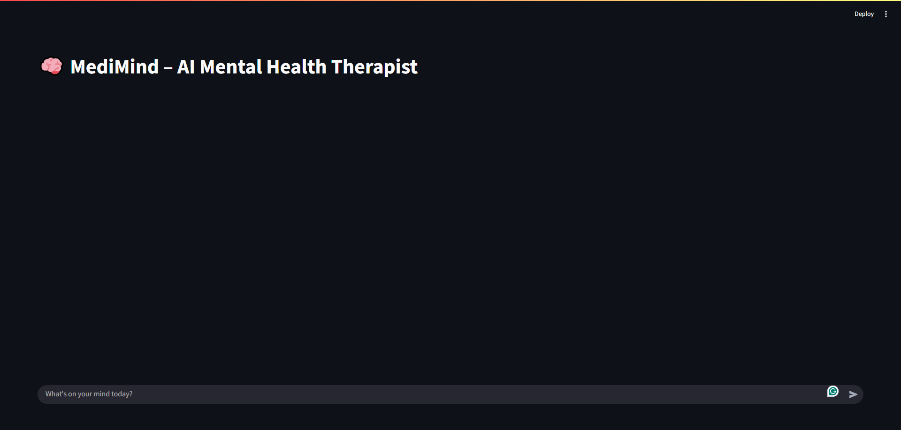

# MediMind


---


---


**MediMind** is an agentic AI-powered mental health support system that combines an LLM-based reasoning agent with tool modules and a simple Streamlit UI. It provides empathetic conversational support, evidence-grounded suggestions, and transparent tool usage while emphasizing safety and clear medical disclaimers.

---



---

## Key Features
- **Agentic architecture**: planner + tool manager + tool calls (retrieval, checks, etc.).  
- **Streamlit frontend** for simple chat interaction.  
- **FastAPI backend** that runs the agent and returns structured JSON (assistant response + tool used).  
- **Safety-first design**: includes disclaimers and system prompts to reduce harmful or misleading outputs.  

---

## Architecture Overview
- **Frontend (Streamlit)**: Captures user input and posts to the backend (`/ask`), displays chat history.  
- **Backend (FastAPI)**: Accepts requests, wraps user input with system instructions, runs the agent graph, parses streamed output, and returns JSON with `response` and `tool_called`.  
- **Agent module (`ai_agent`)**: orchestrates LLM reasoning (graph), includes `SYSTEM_PROMPT`, and a `parse_response` helper to extract final answer and tools used.  

---

## Quickstart (local)

### 1. Clone the repo
```bash
git clone https://github.com/walidad007/MediMind-Ai-Therapist.git
cd MediMind-Ai-Therapist

```bash
---

## 🔹 Option A: Using uv (Recommended)
```bash
# uv is a fast Python package manager.

# Create and activate environment
uv venv
source .venv/bin/activate   # macOS/Linux
.\.venv\Scripts\activate    # Windows

# Install dependencies from pyproject.toml
uv pip install -e .


---

## 🔹 Option B: Using pip (Traditional)

# Create and activate virtual environment
python -m venv venv
source venv/bin/activate   # macOS/Linux
.\venv\Scripts\activate    # Windows

# Install dependencies from pyproject.toml
pip install .

---


**⚠️ Safety & Disclaimer**

MediMind is not a medical professional. Responses are for informational and supportive purposes only. Always consult a qualified healthcare professional for diagnosis and treatment. The system includes guardrails and system prompts to reduce harmful output, but no AI system is perfect.
